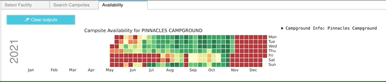

# Creating Interactive Applications in an iPython Notebook via ipywidget, folium, and API</u>

## Table of Contents  
- [Project Details](#project-details)  
- [Setup](#setup)  
- [Primary Packages & Tools](#primary-packages-&-tools) 
- [Data Sources](#data-sources)  
- [Walk-Through](#walk-through)  
    1. [Interactive Mapping](#interactive-mapping)  
    2. [Filtering Search](#filtering-search)  
    3. [Visualizing Search](#visualizing-search)   
    4. [Accessing Real-Time Data](#accessing-real-time-data)  
    5. [Summarize Results](#summarize-availability)  
    6. [Compilation of Search Results](#compilation-of-search-results)  
___

## Project Details

The main objective of this project is to leverage tools within an iPython notebook environment to aid in the development and implementation of an interactive user interface. The final mini application allows users to identify the availability of a particular campground within California, based on a series of search criterias. 

The application calls on several data retrieval methods, including API and webscraping in an effort to consolidate static data into a database, and real-time information. The data is finally presented to the user in an informative visualization output that shows the availability of the campsites within a given time period. 

The initial search provides the spatial context and distribution of campground facilities in CA via an interactive map. The map is supplimented by a series of widgets where the user can filter campsites based on amenities and conditions such as the number of people, vehicles, pets, and equipment preferences. The next tab shows all the campsites that satisfy the search criteria, along with a date picker. The final tab provides a calendar heatmap for the particular group of selected campsites with potential available days within the specified time frame, in addition to the campground information. 

## Setup

Create an `.env` file by copying the `.env.example` and renaming it to `.env`. Replace the keys with your API_KEY

## Primary Packages & Tool

- folium 
- ipywidget
- requests, urllib3, re, beautifulsoup, json
- numpy, panda, geopandas, shapely
- jupyter notebook (ipynb) for displaying custom GUI

## Data Sources

National park database accessed via the RIDB API: 
- https://ridb.recreation.gov/api

    The Recreation Information Database (<a href='https://ridb.recreation.gov/'> RIDB </a>) allows access to information regarding recreational locations nationwide located on federal lands, including historic sites, museums, not limited to soley campgrounds as used for our purposes. 

Campsite availability:
- https://www.recreation.gov/api/camps/availability/

    While the general information of campground sites and facilities were extracted through the RIDB API, the real-time retrieval of campgound availability were done via webscraping. As such, we used the direct url that would be used when individuals typically reserved sites on recreation.gov to obtain a live feeding of data. 

## Walk-Through

### 1. <b>Interactive mapping</b> 

    The initial step of the application allows user to interactively search through campground facilities across the state of California. To do this, we added a map where users can navigate through various regions and even search for a campground of choice. 

    Folium has extensions to easily add various tools within the map, most notable is the reverse geocoding functionality. The pop-up information card for each facility location contains the attributes, including: facility name, unique ID, number of campsites, as well as the description from the recreation.gov site. 

  

### 2. <b>Filtering Search</b>

    After using the interactive map to inform selection of a campground of interest, the buttons on the left-hand side of the panel allow users to specify their preference in amenities. The ipywidget package enables an immersive user experience, allowing increased control over search and data filteration aspects. As seen in the example, there are a wide variety of widgets for each situation, allowing for the intuituve toggling, sliding, and selecting of various search components. 

    The search components include: use type (e.g. overnight or day-use), pets, number of people, number of vehicles, and primary equipment of use (e.g. RV, Tent, Trailer). 

  

### 3. <b>Visualizing Search </b>

    The Search Campshows the locations for the particular campground that satisfies the user-specified search criteria. 

  

### 4. <b>Accessing Real-Time Data</b>

Webscraping 

  

### 5. <b>Summarize Availability</b>

After 

  

### 6. <b>Compilation of search results</b>

Additional searches can be consolidated in the Availability tab for the purpose of allowing the user to compare between several campgrounds of interest. 

