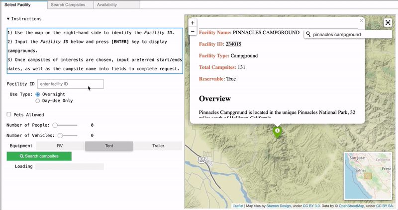
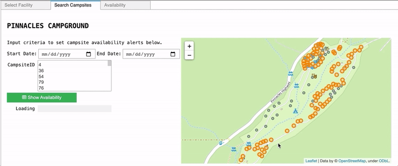
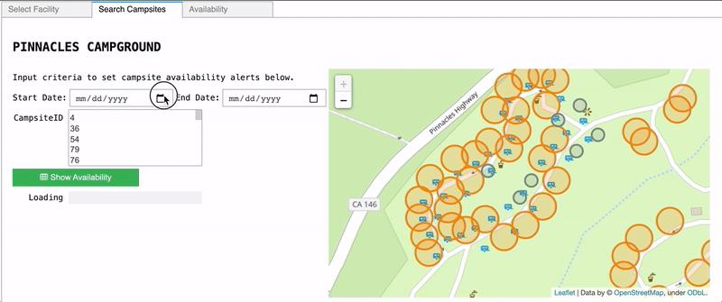
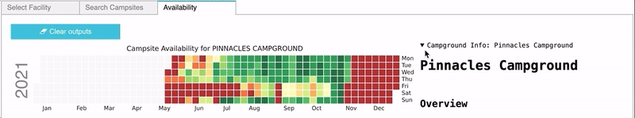

# Creating Interactive Applications in an iPython Notebook Environment via ipywidget, folium, and API</u>

## Table of Contents  
- [Project Details](#project-details)  
- [Setup](#setup)  
- [Primary Packages & Tools](#primary-packages-&-tools) 
- [Data Sources](#data-sources)  
- [Walk-Through](#walk-through)  
    1. [Interactive Mapping](#(1)-interactive-mapping)  
    2. [Filtering Search](#(2)-filtering-search)  
    3. [Visualizing Search](#(3)-visualizing-search)   
    4. [Accessing Real-Time Data](#(4)-accessing-real-time-data)  
    5. [Summarizing Results](#(5)-summarizing-results)  
___

## Project Details

This project serves to leverage tools within an iPython notebook environment to aid in the development of an interactive user interface for exploring campgrounds within California. The application will allow users to identify the availability of a particular campground, based on a series of search criterias regarding location, campsite amenities, and various other conditions. This immersive experience is made possible by an array of packages, mainly folium and ipywidget. 

The application calls on several data retrieval methods, including API and webscraping in an effort to consolidate static data and real-time information that are fed into a database. The resulting data is then presented to the user in an informative visualization output that shows the availability of selected campsites within a specified time period. 

The initial search interface provides the spatial context and distribution of campground facilities in California via an interactive map. The map is supplimented by a series of widgets where the user can filter campsites based on amenities and conditions such as the number of people, vehicles, pets, and equipment preferences. The next tab shows all the campsites that satisfies the search criteria, along with a date picker. The final tab provides a calendar heatmap for the particular group of selected campsites with potential available days within the specified time frame, in addition to an overview of the campground. 

## Setup

Create an `.env` file by copying the `.env.example` and renaming it to `.env`. Replace the keys with your API_KEY

## Primary Packages & Tools

- folium 
- ipywidget
- requests, urllib3, re, beautifulsoup, json
- numpy, panda, geopandas, shapely
- jupyter notebook (ipynb) for displaying custom GUI

## Data Sources

National park database accessed via the RIDB API: 
- https://ridb.recreation.gov/api

The Recreation Information Database (<a href='https://ridb.recreation.gov/'> RIDB </a>) allows access to information regarding recreational locations nationwide located on federal lands, including historic sites, museums, not limited to soley campgrounds as used for our purposes. 

Campsite availability:
- https://www.recreation.gov/api/camps/availability/

While the general information of campground sites and facilities were extracted through the RIDB API, the real-time retrieval of campgound availability were done via webscraping. As such, we used the direct url that would be used when individuals typically reserved sites on recreation.gov to obtain a live feeding of data. 

## Walk-Through

## (1) Interactive mapping

The initial step of the application allows user to interactively search through campground facilities across the state of California. To do this, we added a map where users can navigate through various regions and even search for a campground of choice. 

Folium has extensions to easily add various tools within the map, most notable is the reverse geocoding functionality. The pop-up information card for each facility location contains the attributes, including: facility name, unique ID, number of campsites, as well as the description from the recreation.gov site. 

  

## (2) Filtering Search

After using the interactive map to inform selection of a campground of interest, the buttons on the left-hand side of the panel allow users to specify their preference in amenities. The ipywidget package enables an immersive user experience, allowing increased control over search and data filteration aspects. As seen in the example, there are a wide variety of widgets for each situation, allowing for the intuituve toggling, sliding, and selecting of various search components. 

The search components include: use type (e.g. overnight or day-use), pets, number of people, number of vehicles, and primary equipment of use (e.g. RV, Tent, Trailer). 

  

## (3) Visualizing Search

The Search Camp interface shows the locations for the particular campground that satisfies the user-specified search criteria in orange. The user has the ability to navigate around the entire campground and take a note on the different features for each unique space. While there are additional attributes associated with each site, we limit the search widgets to only deal with the most common search-use cases. 

The smaller gray points are designated for sites that do not meet the search criteria in one way or another, but are shown to provide additional information and context. All points can be clicked to show a pop-up view of primary site amenities and information. 

  

## (4) Accessing Real-Time Data

The primary function of this second tab is to further narrow down the time range and campsites of interest. ipywidget provides a comprehensive date picker, where users can select dates from a calendar dropdown. 

Additionally, the feature to select multiple sites provides the user with further flexibility. The sites may be determined by further examining the supplemental map, which allow attributes such as proximity to roads/trails, spatial orientation, etc. that may be otherwise overlooked to be factored in. 

  

## (5) Summarizing Results

Lastly, when all preferences are taking into consideration, the application calls on the url to retrieve the availability of the selected campsites in real-time. We decided a heatmap would suffice. The calendar style heatmap allows the user to observe days in the year where the campsites of interest are available or not. The 

Furthermore, outputs from each unique search can be consolidated in the final tab. This feature may be quite useful for the purposes of comparing several campgrounds. In this way, the user has on hand the site availability, along with the campground info for (presumably) the same search criteria. The user also has the option to clear all of the outputs if needing to start again.  

  
Additional features can be implemented further down the road including: (1) ability to download results into a pdf or output file, (2) performing a cron job alerting the user if a particular day for a particular campsite becomes available, and/or (3) outputing to a web application using packages not limited to Voila.

